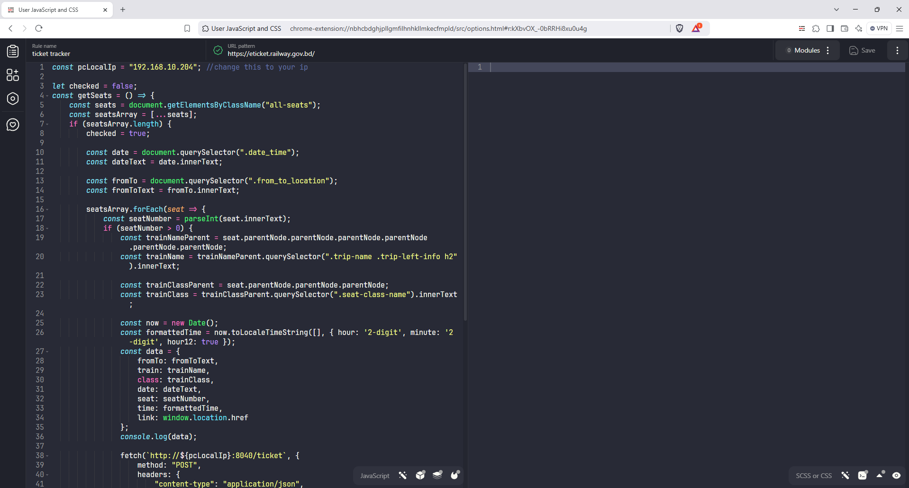
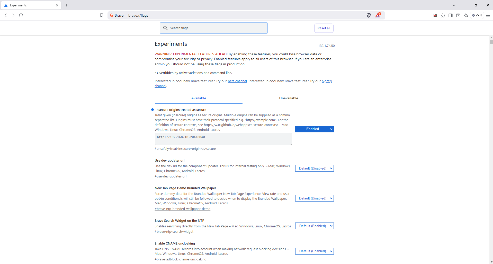

# BD Railway eTicket Tracker

## Overview

BD Railway eTicket Tracker is a tool designed to track ticket availability on the [BD Railway eTicket](https://eticket.railway.gov.bd) platform. It checks for ticket availability every 20 seconds and provides notifications when tickets become available.

## Installation

Follow these steps to set up the BD Railway eTicket Tracker:

1. **Download or Clone the Repository:**

    [Download Link](https://github.com/SazidulAlam47/eTicket-tracker/archive/refs/heads/main.zip)

    or,

    ```bash
    git clone https://github.com/SazidulAlam47/eTicket-tracker.git
    ```

2. **Install Browser Extensions:**

    - Open any Chromium-based browser. _(This is your first browser, used for collecting data.)_
    - Install one of the following extensions:
        - [User JavaScript and CSS](https://chromewebstore.google.com/detail/user-javascript-and-css/nbhcbdghjpllgmfilhnhkllmkecfmpld)
        - [Custom JavaScript for Websites 2](https://chromewebstore.google.com/detail/custom-javascript-for-web/ddbjnfjiigjmcpcpkmhogomapikjbjdk)
    - Enable developer mode from Manage extensions. Go to this link bellow:

    ```bash
    chrome://extensions
    ```

3. **Run the Local IP Script:**

    - Execute `get-local-ip.bat` and copy your local IP address.

4. **Configure Browser Code:**

    - Navigate to the `browser-code` folder.
    - Edit the first line of `eticket.js` to replace `const pcLocalIp = "192.168.10.204";` with your local IP address.
    - Copy the contents of `eticket.js` and paste the copied code into the User JavaScript and CSS extension for [eTicket](https://eticket.railway.gov.bd).

        

5. **Browser Configuration:**

    - Open Browser flags page. Go to this link bellow:

    ```bash
    chrome://flags
    ```

    - Search for "Insecure origins treated as secure" and add your local IP address like this: _http://**YourPcIp**:8040_ (e.g., `http://192.168.10.204:8040`).
    - Enable this setting.
    - Relaunch the Browser.

        

6. **Search for Tickets:**

    - Now search for your desired ticket in this browser. You can open as many tabs as you want with different dates or stations. This browser will refresh every 20 seconds and collect data on ticket availability.
    - **Tip:** If you can't browse the [eTicket](https://eticket.railway.gov.bd) website from this browser because of the frequent refreshes, search for your tickets in another browser. Copy the link of the desired search and paste it into a new tab in this (data-collecting) browser.
    - The active tabs of the [eTicket](https://eticket.railway.gov.bd) website that is searched for tickets, like any station to another station of a date, in this first browser will continue collecting ticket availability data.

7. **Install Node.js:**

    - Download and install Node.js from [Node.js official website](https://nodejs.org/en).

8. **Set Up eTicket Server:**

    - Navigate to the `eticket-server` folder.
    - Run `install-eticket-server-copy.bat` followed by `start-eticket-server.bat`.
    - Minimize the server window without closing it.

9. **Configure eTicket Client:**

    - Navigate to the `eticket-client` folder.
    - Edit the first line of `scrpt.js` to replace `const pcLocalIp = "192.168.10.204";` with your local IP address and save the file.

10. **Run the Application:**
    - From `eticket-client` folder, open `index.html` in a different browser. _(This is your second browser, used for previewing data.)_
    - Press the "Test" button once. The application will notify you when tickets become available.

## Technologies Used

-   JavaScript
-   Batchfile
-   HTML
-   CSS

## Features

-   **User-Friendly Interface**: Simple and intuitive design for ease of use.
-   **Real-Time Updates**: Receive real-time notifications for ticket availability.

Enjoy efficient and hassle-free ticket tracking with BD Railway eTicket Tracker!
